# Lab03 AREP

En este laboratorio se desarrolló un servidor Http con el fin de poder realizar multiples solicitudes, para lograrlo 
se utilizó javascript, css, java y librerias que nos permitan realizar el manejo de la red, más no se utilizaron frameworks
como Spark o Spring.

Se realizo el servidor Http para poder realizar una lista de música, es decir poder manejar tu propia lista de música.

## Screenshots of the project in action

Inicio de la pagina.

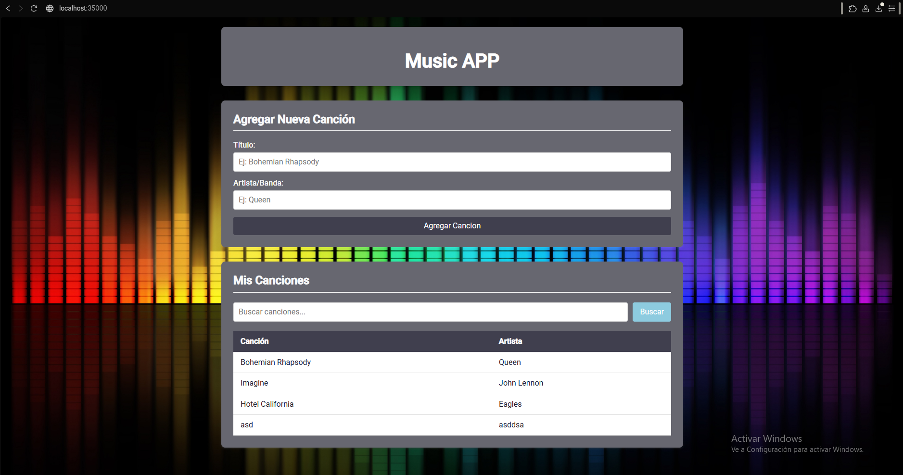

Vamos a añadir una canción a la lista.

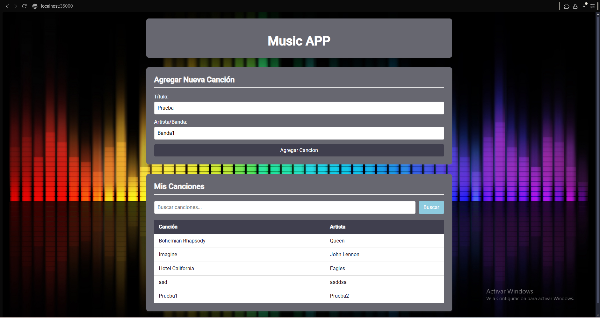

Vemos que se añadio correctamente la canción a la lista de canciones.

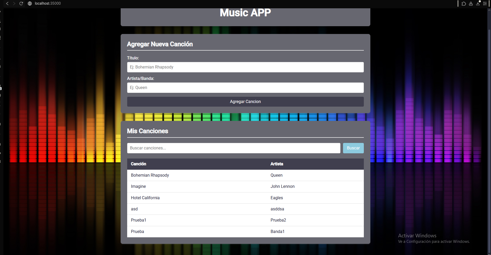

Vemos que la función de buscar canciones funciona de manera correcta.

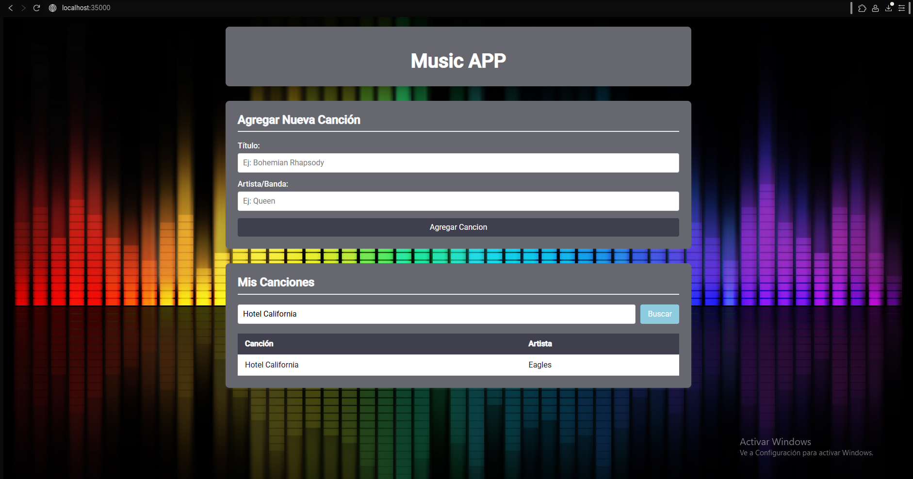

### Screenshoots of the third lab

Aca podemos observar el funcionamiento cuando se ponen diferentes direcciones.

Primero probaremos con lo añadido este laboratorio con "http://localhost:35000/string" recibimos un mensaje"

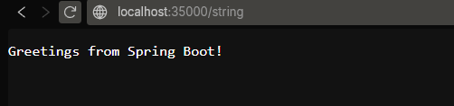

Ahora se mostrara que se puede recibir parametros con lo añadido del microSpringBoot con "http://localhost:35000/greeting?name=PruebaLab"

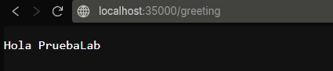

Ahora podemos observar como retorna el número pi con la dirección "http://localhost:35000/pi"

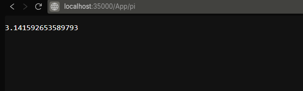

Ahora traemos un Static file siendo en este caso una imagen con "http://localhost:35000/image"

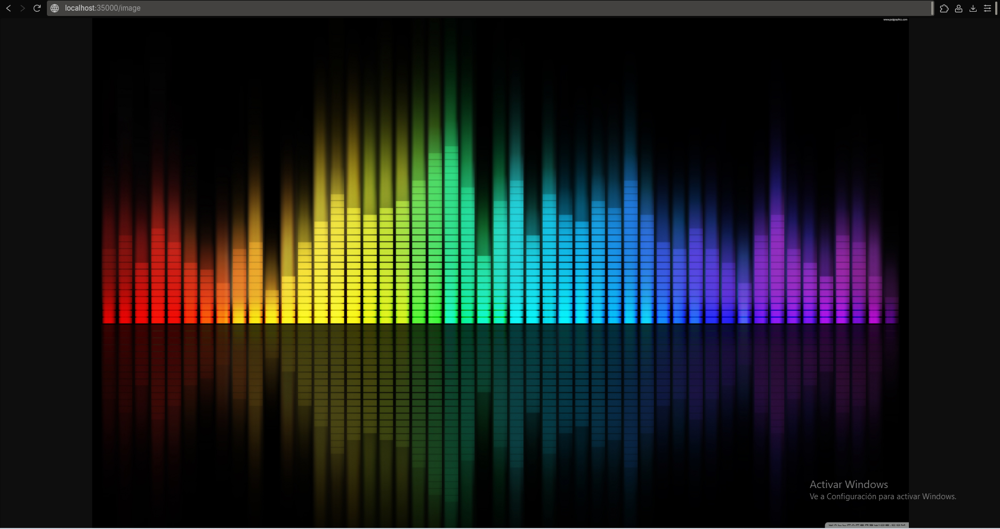

Con la dirección "http://localhost:35000/index.html" se trae el proyecto de música previamente mostrado

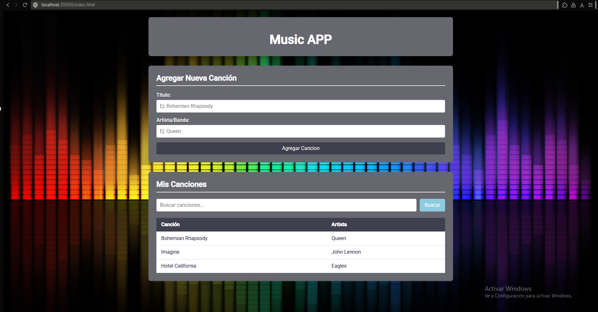

Y por último con la dirección "http://localhost:35000/api/songs" traemos a forma de JSON las listas de música de ejemplo en el proyecto.

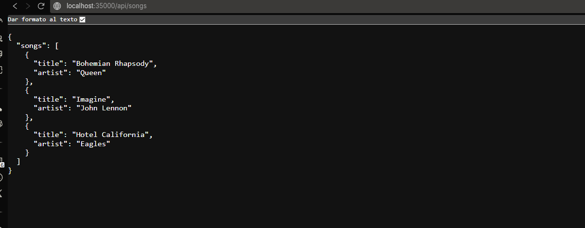

## Getting Started

Lo siguiente que se apreciara son los prerrequisitos para poder correr el proyecto de manera correcta.

### Prerequisites

Los prerrequisitos para poder instalar el proyecto son los siguientes:

```
- Maven
- Cualquier navegador Web
- Java 17+
```
### Installing

A continuación se va a ver el paso a paso para la instalación del proyecto.

1. Clonar el repositorio

```
git clone https://github.com/Santiago-Cordoba/Lab03-AREP.git
```

2. Compilar el proyecto con maven (requisito previamente escrito)

```
mvn package
```

3. Ahora se colocará en la terminal el siguiente comando para ejecutar la clase MicroSpringBoot

```
java -cp target/Lab01-AREP-1.0-SNAPSHOT.jar edu.escuelaing.arem.ASE.app.MicroSpringBoot edu.escuelaing.arem.ASE.app.Controller

```

4. Una vez se esté ejecutando de manera correcta la clase HttpServer, en el navegador podremos colocar las siguientes direcciones para pobrar el funcionamiento:


```
http://localhost:35000/string
http://localhost:35000/greeting?name=PruebaLab
http://localhost:35000/pi
http://localhost:35000/image
http://localhost:35000/index.html
http://localhost:35000/api/songs 
```

## Running the tests

Se corren los test de las diferentes funciones que se programaron para probar el correcto funcionamiento del proyecto.

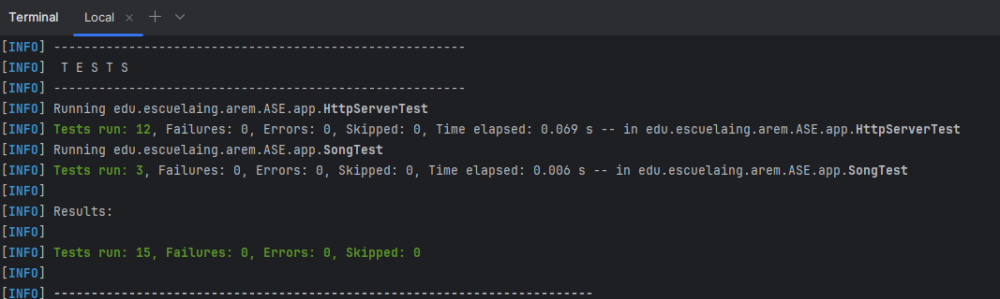


### Architecture

Para Frontend se utilizo:

```
- JavaScript
- HTML
- CSS
```

Para backend se utilizo:

```
- Librerias para el manejo de la red (manejo de las peticiones HTTP).
- Librerias para poder realizar las conexiones con los Sockets
```

Directorio:

```
web-framework/
├── src/
│   ├── HttpServer.java
│   ├── Song.java
│   ├── Request.java
│   ├── Response.java
│   ├── Controller.java
│   ├── MicroSpringBoot.java
│   └── Annotations/
│       ├── GetMapping.java
│       ├── RequestParam.java
│       └── RestController.java
├── resources/
│   └── webroot/
│       ├── index.html
│       ├── style.css
│       └── script.js
├── pom.xml
└── README.md
```


## Built With

* [Java](https://www.java.com/es) - Lenguaje para el backend
* [Maven](https://maven.apache.org/) - Manejo de Dependencias

## Authors

* **Santiago Córdoba Dueñas**  - [Santiago Córdoba](https://github.com/Santiago-Cordoba)

## Acknowledgments

* Conocimiento de como montar un server Http sin la necesidad de usar frameworks como Spring
* Entendimiento del funcionamiento de los Sockets
* Entendimiento del funcionamiento de los microframeworks
* Entendimiento sobre el funcionamiento de SpringBoot por debajo


